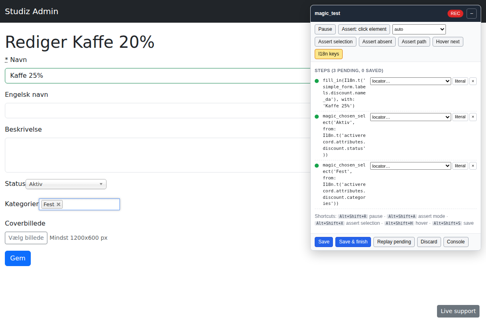
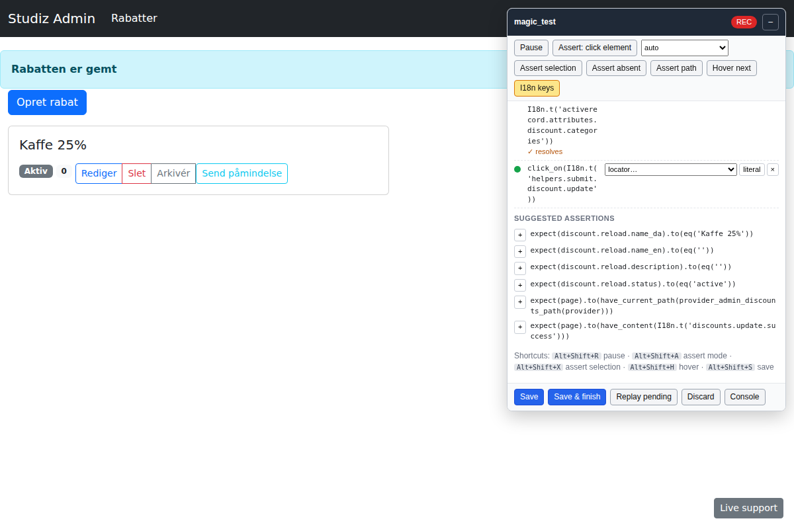
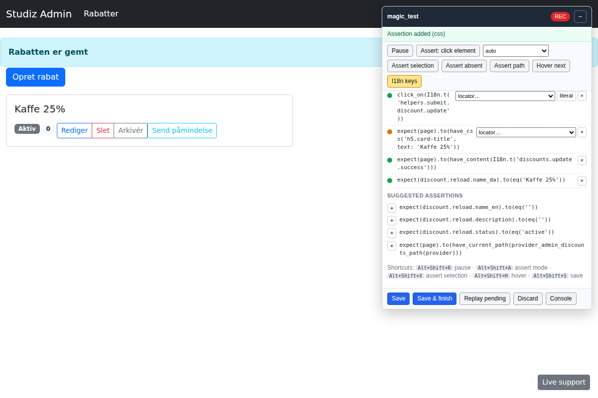
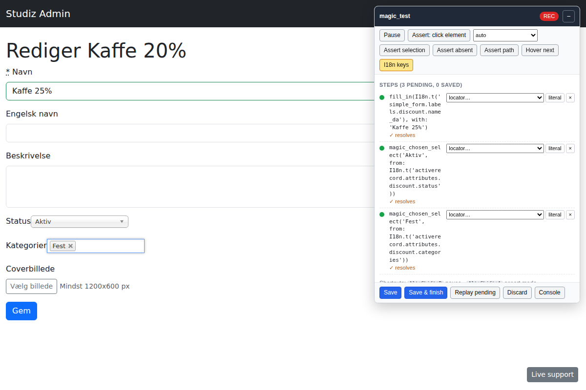
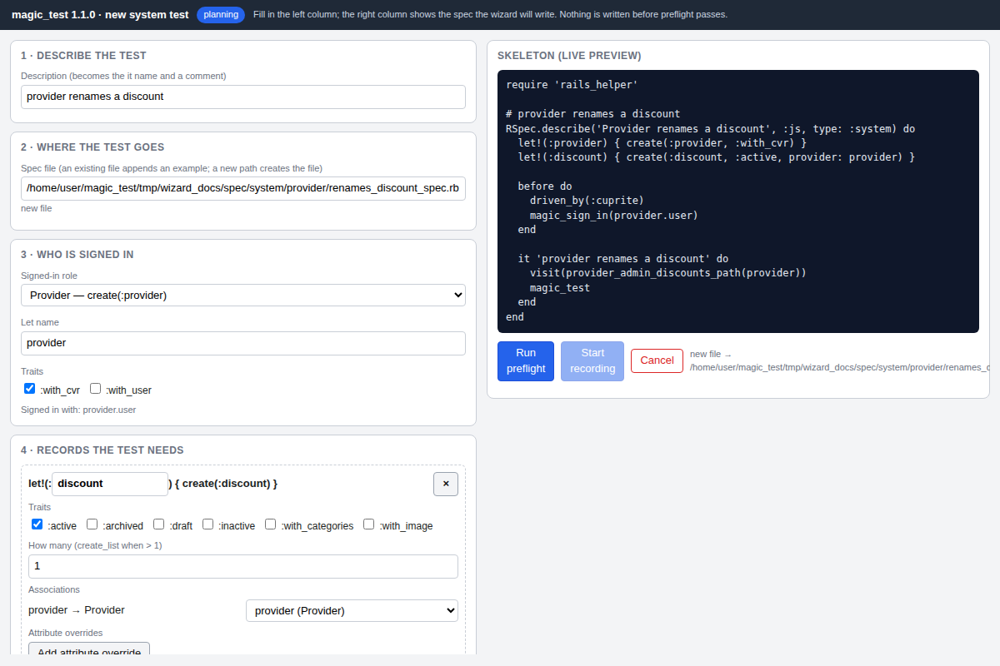
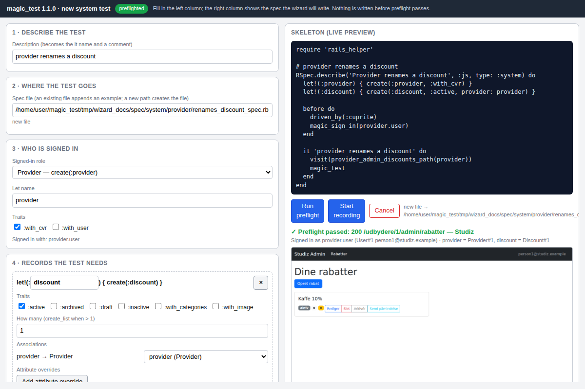
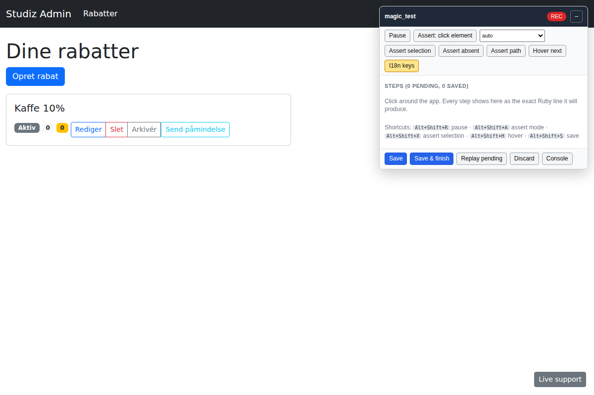

# magic_test (Studiz edition)

Record a system test by clicking around a real Chrome window; get RSpec +
Capybara code that replays headless on the first run. Since 1.1 a wizard
(`bin/magic new`) writes the setup first: records, sign-in, start page,
proven by a preflight before anything is written.

This is a Studiz-specific fork of [magic_test](https://github.com/bullet-train-co/magic_test)
rebuilt for RSpec, Cuprite and the Studiz stack (Rails 7.0, Bootstrap 5,
jQuery, rails-ujs, simple_form, Chosen, flatpickr, Trix, Cropper.js,
route_translator). The website needs no partials, generators or initialisers:
a Rack middleware injects the recorder under `RAILS_ENV=test` + `MAGIC_TEST`,
and nothing is injected, mounted or added otherwise.

| Recording | Suggestions after a save |
| --- | --- |
|  |  |

| Assert mode | Replay pending |
| --- | --- |
|  |  |

Screenshots are recorded from the fixture app in headless Chrome
(`bin/rake docs:screenshots`).

## Install

```ruby
# Gemfile
gem 'magic_test', github: 'PatrickPLG/magic_test', branch: 'studiz-recorder-v1', group: :test
```

```sh
bundle install
bundle binstubs magic_test --force
```

Requirements: Ruby ≥ 3.2, Rails ≥ 7.0, Capybara ≥ 3.40, Cuprite ≥ 0.15,
RSpec system specs (`type: :system`) driven by Cuprite. Pry is optional.
Studiz maintainers: see [MIGRATION_STUDIZ.md](MIGRATION_STUDIZ.md) for the
five-minute clean-up of the old integration.

## Workflow

1. Write the spec up to the point you want to record, with the setup you
   already have, and call `magic_test`:

   ```ruby
   RSpec.describe 'Provider edits a discount', :js, type: :system do
     let!(:provider) { create(:provider) }
     let!(:discount) { create(:discount, provider: provider, name_da: 'Kaffe 20%') }

     before { sign_in_as_provider(provider) }

     it 'renames the discount' do
       visit provider_admin_discounts_path(provider)
       magic_test
     end
   end
   ```

2. Run it with recording on:

   ```sh
   bin/magic spec spec/system/provider/discounts_spec.rb
   # the same as: MAGIC_TEST=1 bin/rspec spec/system/provider/discounts_spec.rb
   ```

   Chrome opens headed at 1200×800 (even though the spec's `driven_by`
   would make it headless). The spec runs to `magic_test`, then the toolbar
   appears in the page and the spec waits.

3. Click around. Each action shows up in the toolbar as the exact Ruby line
   it will write, with a confidence badge. Fix a locator, toggle I18n keys,
   delete a step, or add a suggested assertion right there.

4. **Save** writes the steps directly above the `magic_test` line, with the
   right indentation, after a syntax check. **Save & finish** also ends the
   session so the spec finishes normally.

5. Run the spec again without `MAGIC_TEST`: everything replays headless.
   Leave `magic_test` in place to resume later: it is a no-op unless
   `MAGIC_TEST` is set, and with it set the saved steps replay first and
   recording resumes where you left off.

## Starting a new test with `bin/magic new`

The wizard writes the part you would otherwise type by hand (records,
sign-in, first visit) and drops you into the recorder on that page:

```sh
bin/magic new                     # browser wizard in the headed Chrome window
bin/magic new --tui               # the same questions in the terminal
bin/magic new --plan plan.yml     # non-interactive: preflight, write, record
bin/magic new spec/system/provider/discounts_spec.rb   # append to a file
```

| Form and live preview | Preflight result |
| --- | --- |
|  |  |



It asks for:

1. **A description**, which becomes the `it` name and a leading comment.
2. **Where the test goes**: a new file (path suggested from the role and
   the description) or an existing spec. For an existing file the wizard
   parses its `describe`/`context` blocks, reuses lets whose name, factory
   and traits match, renames a colliding let from its trait
   (`archived_discount`) and, when the block lacks the sign-in or the new
   lets, opens a `context` with its own `before`.
3. **The signed-in role**: every model with `has_one :user, as: :role`,
   plus `Institution` (signs in through its leader employee's user), or
   guest. The role record is a normal `let!`, flagged as signed in.
4. **Records**: factories with their defined traits, a count
   (`create_list` above 1), `belongs_to` associations wired to the one let
   of a matching class (editable: another let, "let the factory build it",
   or `nil` with a warning when the column is NOT NULL), and attribute
   overrides validated against the columns and enum values.
5. **The start page**: the app's named GET routes, the role's namespace
   first, with the params mapped to lets and the locale (`_en_path` for
   `/en/...`).
6. **Extras**: Flipper flags (globally or per actor), `travel_to`, a
   viewport (desktop 1200×800, tablet, mobile 390×844), cookie consent for
   guests, `Sidekiq::Testing.inline!` around the steps, an email assertion
   slot, and fixture files.

Every change re-validates the plan and shows the skeleton on the right.
**Preflight** then runs the setup inside the real example (FactoryBot,
DatabaseCleaner, Flipper and `travel_to` behave exactly as in the spec),
checks each record is valid and persisted, resolves the user, signs in and
visits the start page in a second window. It reports status, final path,
JS errors and a screenshot, and on failure names the stage and a fix:

```
preflight failed at sign_in: institution.employees.find_by(...)&.user is nil: Institution has no user to sign in with.
  (fix: add trait :with_user to let!(:institution) (the institution needs a leader employee with a user))
preflight failed at visit: /institutioner/1/studerende answered 403 Forbidden.
  (fix: the route param :institution_id points at provider (a Provider); it probably needs a let of class Institution)
```

Nothing is written until preflight passes. Then the skeleton is written
(atomically, syntax-checked) and recording starts in that same window with
the preflight data still in place. The written spec reproduces the same
state when it runs on its own later; the golden wizard flows prove it 3/3.

A written skeleton looks like this:

```ruby
require 'rails_helper'

# provider renames a discount
RSpec.describe('Provider renames a discount', :js, type: :system) do
  let!(:provider) { create(:provider, :with_cvr) }
  let!(:discount) { create(:discount, :active, provider: provider, name_da: 'Kaffe 20%') }

  before do
    driven_by(:cuprite)
    magic_sign_in(provider.user)
  end

  it 'provider renames a discount' do
    visit(provider_admin_discounts_path(provider))
    magic_test
  end
end
```

A plan file for `--plan` is the same information as YAML (the wizard saves
the last one to `tmp/magic_test/last_plan.yml`):

```yaml
description: provider renames a discount
target: { path: spec/system/provider/renames_discount_spec.rb }   # add block: ["Provider discounts"] to append
signed_in: provider
models:
  - { let: provider, factory: provider, traits: [with_cvr] }
  - { let: discount, factory: discount, traits: [active], attributes: { name_da: Kaffe 20% } }
start: { route: provider_admin_discounts, params: { provider_id: provider }, locale: da }
extras: { flags: [{ name: beta_dashboard, actor: provider }], travel_to: "2026-12-24 10:00", viewport: mobile, sidekiq_inline: true, mail_assertion: true }
```

Configuration for the wizard:

```ruby
MagicTest.config.user_for_role["Institutions::Library::Library"] = ->(let) { "#{let}.user" }  # role class => user expression
MagicTest.config.wizard_driven_by = "driven_by(:cuprite)"   # first line of the generated before; nil to omit
MagicTest.config.login_paths = %w[/users/sign_in /login]     # a preflight landing here means "not signed in"
```

Limits of the wizard: it introspects, it does not read your seeds or
`default_scope`s, so a factory that needs data the plan does not name shows
up as a preflight failure rather than being guessed; attribute overrides are
strings and integers (dates and times as strings); models added through the
browser's "add let!" button get the default factory without traits; the
terminal wizard cannot draw the preflight screenshot.

## The toolbar

A draggable, collapsible panel in a Shadow DOM (app CSS cannot touch it, it
cannot touch the app). Everything it does goes through
`/__magic_test/commands`, so a scripted session can drive it too.

| Control | Shortcut | What it does |
| --- | --- | --- |
| Pause / Record | Alt+Shift+R | Stop recording while you set something up by hand. |
| Assert: click element | Alt+Shift+A | The next click becomes an expectation instead of an action. The dropdown picks the type (auto, content, field value, checked, selected, button, link, css count). |
| Assert selection | Alt+Shift+X | Highlighted text → `expect(page).to(have_content(...))`. |
| Assert absent | | Highlighted text → `have_no_content`. |
| Assert path | | `expect(page).to(have_current_path(route_helper))`. |
| Hover next | Alt+Shift+H | Record a hover on the next element you click, or on the element under the mouse when you press the shortcut. |
| I18n keys | | Emit `I18n.t('key')` (default) or the literal text, for the whole session. Each step also has its own toggle. |
| Save | Alt+Shift+S | Write pending steps above `magic_test`. |
| Save & finish | | Write and end the session. |
| Replay pending | | Resolve every pending locator against the live page without performing the actions. |
| Discard | | Drop the pending steps. |
| Console | | `binding.pry` in the terminal when Pry is loaded (`flush` and `ok` work there). |

Badges: **green** is a unique semantic locator verified with Capybara's own
matching; **amber** is a locator inside a `within` scope or a CSS locator;
**red** needs review and carries a `# magic_test: REVIEW …` comment above
the line. The recorder never guesses silently.

## What gets recorded

Every step is verified in the browser with the XPath Capybara itself
compiles for `click_on`, `fill_in`, `select`, `check` and friends, so a
locator that is green in the toolbar is unique for Capybara too.

| You do | Generated |
| --- | --- |
| Click a link or button | `click_on(I18n.t('events.index.new'))`; `click_link`/`click_button` when the text is ambiguous across links and buttons; `find('button.js-star').click` for icon-only controls |
| Type into a field | `fill_in(I18n.t('activerecord.attributes.lead.name'), with: 'Erik Hansen')` — the final value, so paste, autofill and mid-value edits are exact |
| Press Enter in a field | `find_field(...).send_keys(:enter)` |
| Tick or untick a checkbox | `check(label)` / `uncheck(label)`; `allow_label_click: true` when the input is visually hidden behind a custom checkmark |
| Pick a radio | `choose(label, allow_label_click: true)` |
| Change a native select | `select('Sverige', from: I18n.t('activerecord.attributes.student.country'))` |
| Pick in a Chosen select | `magic_chosen_select('Fest', from: I18n.t('...category'))`, `magic_chosen_unselect(...)` for multiple selects |
| Pick a flatpickr date | `magic_set_date(I18n.t('...starts_at'), '24/09-2026 14:00')` |
| Type in a Trix editor | `magic_fill_trix(I18n.t('...description'), with: 'Kom til fredagsbar')` |
| Choose a file (+ Cropper) | `magic_attach_image('Vælg billede', Rails.root.join('spec/fixtures/files/cover.png'))`; `attach_file(..., make_visible: true)` for plain inputs; a REVIEW comment when no fixture file with that name exists |
| Answer a `confirm`/`alert`/`prompt` | `accept_confirm(I18n.t('discounts.index.confirm_delete')) do … end`, `dismiss_confirm`, `accept_alert`, `accept_prompt(with: …)` — the dialog is shown in the toolbar and the click is re-issued with your answer |
| Work inside a Bootstrap modal | `within('#ajax-modal') do … end`, merged for consecutive steps |
| Work in a table row / form / section | `within('tr', text: 'Bente') do … end`, `within('form#new_lead')`, `within(all('div.ticket-type-fields', minimum: 2)[1])` for repeated nested fields |
| Work inside an iframe | `within_frame('preview') do … end` |
| Open a new window | the click is wrapped in `new_window = window_opened_by do … end`; steps taken in the new window follow a `visit` of its URL (see limits) |
| Navigate (link, redirect, typed URL) | `visit(institution_events_path(institution))` with `let` names for ids, `_en_path` helpers for `/en/...` pages |
| Hover (explicit) | `find_link(I18n.t('nav.help')).hover` |

Text becomes `I18n.t('key')` when exactly one key in the merged backend
renders it. Ties are broken by the template that rendered the page
(`backoffice/leads/index` → `leads.index.edit`), by the form action
(`helpers.submit.<model>.create` vs `.update`) and by the model implied by
the template path; what is left ambiguous is emitted as a literal with the
candidate keys in a REVIEW comment. Pages rendered in another locale get
`I18n.t('key', locale: :en)`.

Ids, classes and names that vary between runs (record ids, timestamps,
`trix_input_3`, `_attributes_0_`, Bootstrap utility and state classes,
`chosen-with-drop`, …) are never used in a locator.

### Suggestions

After each step the toolbar offers assertions that follow from what the
server saw. Click **+** to add one (or **+block** for the `expect { }.to
change` form):

```ruby
expect(page).to(have_content(I18n.t('discounts.update.success')))   # flash
expect(page).to(have_current_path(provider_admin_discounts_path(provider)))
expect(page).to(have_no_css('#ajax-modal.show'))                     # modal closed
expect(Events::Event.count).to(eq(1))                                # DB change
expect(discount.reload.name_da).to(eq('Kaffe 25%'))                  # column change
expect(page).to(have_content('Rabatten er gemt'))                    # toast
```

DB-change suggestions skip bookkeeping tables: `schema_migrations`,
`ar_internal_metadata`, `sessions`, Active Storage, `audits`, `ahoy_visits`,
`ahoy_events`, `flipper_features`, `flipper_gates` and every `live_support_*`
table. `MagicTest.config.ignored_tables` adds to that list (strings match a
table name, regexps are matched against it); assigning to it keeps the
defaults.

### Setup for the next run

The recorder starts after the example's `let!`/`before` blocks have already
run, so it cannot add setup that the current session depends on. Instead it
suggests it: the sign-in line for the Warden user it saw
(`sign_in_as_provider(provider)`) and `let!` factory lines for records the
recorded paths use that no `let` explains. Accept, re-run, and recording
resumes above `magic_test`.

## Helpers

Included into every `type: :system` example group in the test environment,
with or without `MAGIC_TEST`. None of them sleeps.

```ruby
magic_test                                  # start recording here (no-op unless MAGIC_TEST)
magic_chosen_select('Fest', from: 'Kategori')          # Chosen single or multiple select
magic_chosen_unselect('Fest', from: 'Kategorier')      # remove a choice from a multiple select
magic_set_date('Starttidspunkt', '24/09-2026 14:00')   # flatpickr, through the widget's API
magic_fill_trix('Beskrivelse', with: 'Kom til fredagsbar')
magic_attach_image('Vælg billede', Rails.root.join('spec/fixtures/files/cover.png'))
magic_apply_crop                            # the Cropper modal's apply button, waits for it to close
magic_within_modal { fill_in('Navn', with: 'Ida') }   # whichever Studiz modal is open, once loaded
magic_sign_in(provider.user)                # Devise sign-in plus the auth_token and cookie_settings cookies
```

`from:` for the Chosen helpers is the label, id or name of the underlying
`<select>`, which Chosen hides; the container id (`discount_status_chosen`)
is never needed.

## Configuration

```ruby
# spec/support/magic_test.rb (loaded by rails_helper)
MagicTest.config.i18n_keys = true                # I18n.t keys by default (toolbar can toggle)
MagicTest.config.assertion_style = :house        # expect(Model.count).to(eq(n)); :change prefers the block form
MagicTest.config.locale = nil                    # nil: the locale of the page being recorded
MagicTest.config.fixture_files_dir = "spec/fixtures/files"
MagicTest.config.ignored_request_paths << %r{\A/api/ping}   # background traffic never counts as an effect
MagicTest.config.ignored_tables << "report_rows"              # no DB-change suggestions for this table (String or Regexp)
MagicTest.config.window_size = [1200, 800]
MagicTest.config.command_timeout = 20            # seconds a toolbar command may take
MagicTest.config.studiz_modals = %w[#ajax-modal #full-view-modal #image-cropper-modal]
```

Environment variables:

| Variable | Effect |
| --- | --- |
| `MAGIC_TEST=1` | Enable recording: middleware, engine routes, headed Chrome. |
| `MAGIC_TEST_HEADLESS=1` | Keep Chrome headless while recording (CI, scripted runs). |
| `MAGIC_TEST_SCRIPT=path.rb` | Drive the session from a script instead of a person (the golden-flow harness). The toolbar is not mounted unless `MAGIC_TEST_TOOLBAR=1`. |
| `MAGIC_TEST_DEBUG_DIR=dir` | Write the raw event log, request log and steps as JSON when a session ends. |

## Limits

- **Setup is suggested, not inserted.** See above.
- **Files.** The recorder cannot read the path a person picked in the file
  dialog. It records the file name and maps it to
  `spec/fixtures/files/<name>` when that exists; otherwise the step carries a
  `# magic_test: REVIEW add fixture file` comment.
- **New windows.** Steps taken in a window opened by a click are replayed in
  the main window after a `visit` of that window's URL. `within_window` is
  not emitted; the `new_window = window_opened_by` assignment is there if
  you want to switch by hand.
- **Hover is explicit.** Mouse movement is never recorded; use the toolbar
  button or Alt+Shift+H. A hover that opens nothing is flagged amber.
- **Not recorded:** drag and drop (sortable), keyboard shortcuts other than
  Enter, right-clicks, typing into `contenteditable` elements other than
  Trix, cross-origin iframes, subdomain routes. Clicks on autocomplete,
  tagsinput and chart widgets are recorded as plain clicks on whatever was
  clicked.
- **Time.** Datetime values are emitted as `Time.zone.parse(...)` and dates
  as `Date.new(...)`; nothing freezes the clock. Use `travel_to` yourself
  when a flow depends on today's date.
- **Verified against the fixture app, not Studiz.** The 24 golden flows
  replay 3/3 on the replica in `spec/fixture_app`, which reproduces
  Studiz's markup and widget versions. The real application was not
  available while this fork was built.

## Troubleshooting

- **`magic_test: app/views/magic_test overrides the gem's views`** at boot:
  delete that directory in the app ([MIGRATION_STUDIZ.md](MIGRATION_STUDIZ.md), step 1).
- **The toolbar does not appear.** Check that `MAGIC_TEST` is set, that the
  response is HTML with a `</head>`, and that `MAGIC_TEST_SCRIPT` is not set.
  In DevTools, `MagicTest.status()` should read `"recording"` and
  `MagicTest.errors()` should be empty.
- **`several I18n keys render "Rediger"`** in a REVIEW comment: pick one of
  the listed keys, or toggle that step to the literal text.
- **`command save timed out`**: raise `MagicTest.config.command_timeout`,
  or check the terminal for a syntax error the writer refused to save.
- **Chrome as root** (containers): Cuprite needs `--no-sandbox`. Point
  `browser_path` at a wrapper that adds it, as `spec/support/bin/chrome`
  does in this repo.
- **A click is attributed to background traffic** (live support, pings):
  add the path to `MagicTest.config.ignored_request_paths`.
- **Steps missing after a full page load**: the browser buffers unsent
  events in sessionStorage and replays them on the next page; if the next
  page is not HTML (a download), save before clicking.
- **Debugging a wrong step**: run with `MAGIC_TEST_DEBUG_DIR=tmp/magic_test`
  and read the JSON dump, which has every event with all its candidate
  locators and every request with its templates and DB changes.

## Development

```sh
bundle install && npm ci                       # eslint only; no build step
bin/standardrb && npx eslint app/assets/javascripts/magic_test/src spec/js
bin/rspec --tag ~recorder                      # unit, helpers, "injects nothing", wizard engine (MAGIC_TEST unset)
MAGIC_TEST=1 MAGIC_TEST_HEADLESS=1 bin/rspec --tag recorder   # audit, JS unit tests, parity, toolbar, wizard UI/TUI/preflight, golden flows
bin/rake spec                                  # both passes
```

Golden flows (`spec/golden/<name>/flow.rb` + `expected.rb`) record a
scripted session in a subprocess, replay the generated spec three times on
fresh databases, run rubocop with Studiz's rules and diff against the
snapshot. Golden wizard flows (`spec/golden_wizard/<name>/flow.rb`) do the
same from a plan: `bin/magic new --plan` in a subprocess, then the written
file is replayed 3/3 and diffed. `GOLDEN=a,b` runs a subset, `UPDATE_GOLDEN=1` rewrites snapshots,
`FIXTURE_APP_DB=db/x.sqlite3` isolates parallel runs.

Design notes are in [docs/DECISIONS.md](docs/DECISIONS.md); the Phase 0 audit
of the previous recorder is in [docs/AUDIT.md](docs/AUDIT.md).

## Credits and license

Original gem by Andrew Culver and Adam Pallozzi for
[Bullet Train](https://bullettrain.co). This fork is maintained for Studiz.
MIT License, see [LICENSE.txt](LICENSE.txt).
